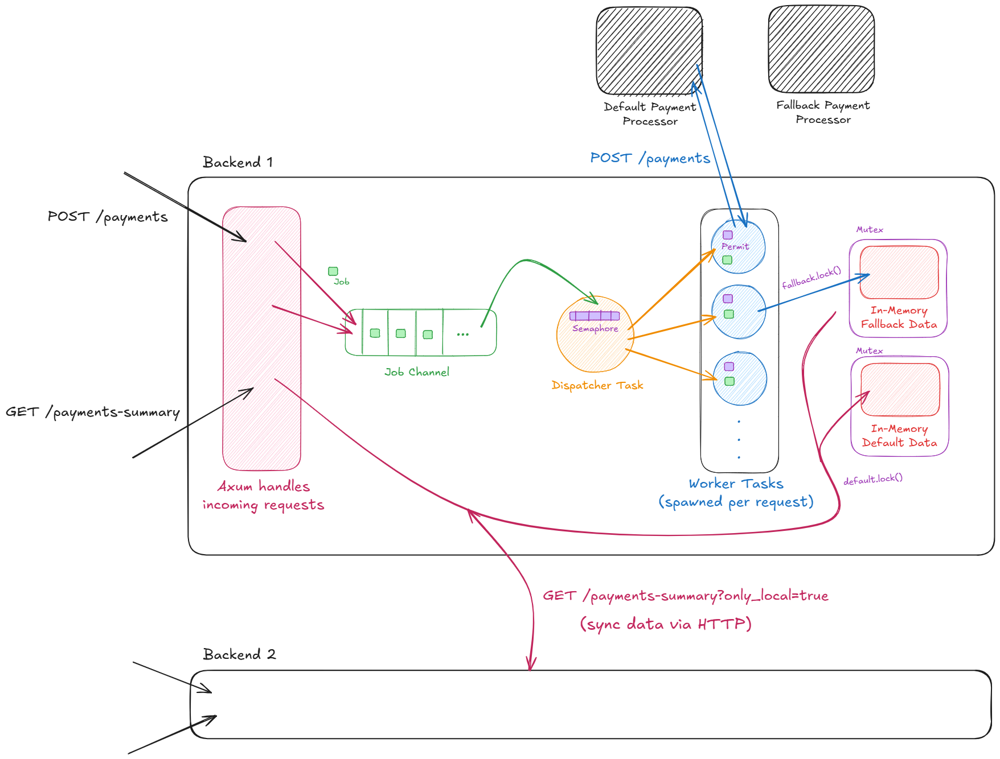

# Project
This is my submission for the "Rinha de Backend 2025" (2025 Backend Showdown) competition. The goal of the competition was to create a backend instance that would act like a payment proxy: it should receive HTTP requests containing payloads that should be forwarded to payment processor instances through an HTTP request as well. Each processed payment would compose the total amount of payments processed by your backend instance. This is the value that determines the position of the participant in the final scoreboard. Moreover, participants would get a bonus of up to 20% of the total amount processed by their backend depending on how fast they handled the requests. Here are some rules from the challenge:
- It's imperative to have two running instances of the provided backend client (consequently a load balancer to distribute the load between them).
- Maximum resource allocation is 1.5 CPUs and 350MB of memory (between all services).

Particularly, for the final submission my backend performed badly due to poor choices on how to handle some particularities of the challenge and not accounting for the increase in the load of the final test. Nonetheless, the architecture utilized by my backend after I fixed the issues so it would perform reasonably is the same as the one I submitted. In order to try to achieve maximum performance and consistency in the results I made the following assumptions:
- There will be many more POST requests made to our backend than GET ones.
- We can instantly respond to a POST request with an OK status, regardless of whether it will be processed at any time in the future or it will error.
- GET requests search for a range of values. Due to the nature of concurrency we cannot assume that the values will be stored in order. Therefore we need to store data in a smart way that facilitates retrievals but also doesn’t induce too much overhead for writes.

# Overview

# Development
The Rust `axum` crate was chosen for handling incoming HTTP requests due to the ease of use it provides. We just need to define the routes and HTTP methods each one accepts and the address it will listen to. Also, as a proxy we need to make HTTP requests, which can be achieved through the use of the `reqwest` crate. The first important choice I had to make was related to the database to store the payments.

## Database
In the previous edition I had used Postgres, but the use case of this edition didn't require any relational features: we only need to store the timestamp, value, and number of requests processed by our proxy. At first, Redis seemed a good choice due to its in-memory nature: it would be very difficult for our backend to use more than those 350MB of memory so storing data there is safe. However, when trying to use the `redis-rs` crate I had some trouble using the methods' interfaces and how to perform operations with them, so it just wouldn't do.

While reading the documentation of the `tokio` crate (async runtime we used in this submission) I realized the tutorial project was a "mini" version of Redis (hence [mini-redis](https://github.com/tokio-rs/mini-redis)). At first, copying and adapting this db for our use case was easier than learning the Redis library. I could even implement a working version using this database but soon realized there was no need for it.

Notice that by using a single instance of the custom Redis db our backend instances would have to communicate with it via network requests (which, in turn, results in additional system calls). Not that I could measure the impact of system calls in my submission, still it's better to avoid any unnecessary overhead since we are trying to maximize performance. The solution was to place the "database" instance inside the same process as the backend. Each backend instance would have its own private data structure acting as its local db. However, since we don't know which instance will receive the GET request it was necessary to introduce some kind of synchronization between the data stored in each instance. My approach here was to leverage the `payments-summary` GET endpoint, which should fetch this data, to act as the sync mechanism between the instances: by providing an `only_local` URL param I instruct the other backend instance to only fetch local data. So, upon receiving a GET request without this param the backend instance knows that it must fetch its own local data and the other instance's data as well (by making the GET request with the param set now).

To choose the data structure to use as db we had to consider the actions necessary to be performed on it: insertions and retrievals. Starting with retrievals the idea here is to search for a range of values: GET requests provide the `from` and `to` URL params, which determine the temporal range to fetch data from the tool. The fastest way to do this search is through a data structure that maintains its elements ordered by timestamp. A hash map will not suffice for this requirement because even though insertions would be very fast since we only need to hash the timestamp, the searches would require traversing all items. Regarding insertions, the expected behavior was to receive ordered data most of the time: since the test would simulate users making requests, they would always come with increasing timestamps (almost always since scheduling by the CPU could preempt one request to be processed before one that came before and so on). A `Binary Search Tree` wouldn't be the appropriate choice in this case since we would effectively get a linked list and probably the cost of having to rebalance the tree would be bad as well. In the end the `BTreeMap` data structure was the go-to option for this use case, since it provides a `range` method that has `O(log n)` complexity for searches and insertions are mostly appends in arrays, which by definition can leverage cache, so all in all it seemed a great choice. To avoid any race condition issues the handlers for the database instances are behind `std::sync::Mutex`, so only one task can interact with the db at a time.

## Tasks
At this point our backend is able to receive/make HTTP requests and to store/sync data. This could work optimally if everything was instantaneous: after receiving the HTTP request, if we could instantly get the response from the remote processing units and write this data to memory (which avoids I/O-bound operations to disk) we would be fine. Yet, this challenge would not be so simple. You see, network requests are not instantaneous, they are I/O-bound operations where our CPU would sit idle waiting for the processing unit's response while it could be processing other incoming requests. Even worse: one of the features of this competition was the fact that the payment processing units would face moments of instability during the stress test, in which they could take many ms to respond or not even work at all (replying with 500s).

The way to approach this class of problems is to leverage asynchronous programming. Once our task executing some code has to wait for some I/O-bound operation (network request) we can set it aside and use the CPU to process other tasks. Once we receive the response we were waiting for we can wake up this task and let it finish its execution. My approach to use tasks in this challenge worked as follows: a master task, called `dispatcher` would be instantiated. This master task would have the receiving end of a `tokio::mpsc::channel` (multiple-producer single-consumer). In this channel the Axum-spawned tasks (to handle incoming HTTP requests) would place the POST jobs that our backend tasks should perform. Consequently, upon receiving a message containing the job the master task would spawn another task and assign it this job. By doing this we improve the throughput of our backend: we trade waiting time for processing time, which enables us to process more requests than before.

Even though this approach would persist in the fixed version of the submission, this doesn't mean it is perfect. In fact, here we face the first issue that led to poor performance in the final results of the competition. Basically, if there is no limit to how many concurrent requests our backend can spawn, there will be times during the stress test in which our backend will produce inconsistencies. "Consistency" is achieved when our backends (in total) have processed the same amount of requests and total value as the processing units. My guess is that, by allowing an arbitrary number of tasks to be spawned, at some point in time when both services (our backend and the processing unit) receive the GET `payments-summary` requests, there will be so many queued tasks to be woken up that the CPU will preempt them with our GET tasks, which will result in `X - N` requests processed when compared to the remote processing unit, which processed `X` requests.

To solve this issue I introduced a `tokio::sync::Semaphore` to limit concurrency. For each task spawned by the master we transfer ownership of one of the Semaphore's available permits. Once the spawned task finishes its job this permit is dropped, becoming available to another task. Turns out that lowering the number of maximum concurrent spawned tasks (to about 100) would eliminate any inconsistencies (possibly, because I couldn’t make enough tests to prove this).

Finally, in order to increase the total amount of processed payments we would need some sort of scheduling algorithm of our own for the processing tasks. The competition provides two remote payment processing instances, `Default` and `Fallback`. The difference between them is that they charge different processing fees and they can fail or have delays in different moments during the test. If we make all requests to the default instance (which charges a smaller fee), during the moments where it is unavailable we should forward requests to fallback. In the end, it is always better to process a payment instead of not doing so. Of course, there should be a balance between assigning requests to fallback and reducing the ones made to default. As the end of the competition approached I couldn't spend much time on this, so the algorithm is really simple: we always start making requests to default, for any incoming payment. However, we keep track of how many times a task has failed: for each failure we switch the instance that will process the payment until one successfully does so. The problem with this approach is that it doesn’t consider the delays, so in the end the amount of requests sent to fallback was still small.

# Results
Testing locally is definitely not a reliable source of ground-truth results. I got varying results for the number of processed payments and p99. This is due to the fact that my machine has a lot of other processes to share the CPU with. The only consistent value for this strategy was getting 0 inconsistencies during the final test. The number of processed payments stayed close to 80k out of 90.5k transactions and the p99 around 4ms.
